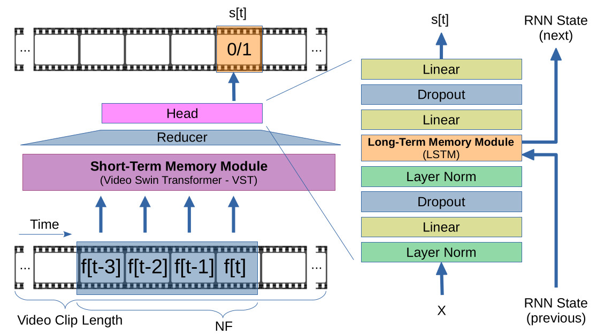

## [Memory-augmented Online Video Anomaly Detection (MOVAD)](https://arxiv.org/abs/2302.10719)

Official PyTorch implementation of **MOVAD**.

We propose **MOVAD**, a brand new architecture for online (frame-level) video
anomaly detection.



Authors: Leonardo Rossi, Vittorio Bernuzzi, Tomaso Fontanini,
         Massimo Bertozzi, Andrea Prati.

[IMP Lab](http://implab.ce.unipr.it/) -
Dipartimento di Ingegneria e Architettura

University of Parma, Italy


## Abstract

The ability to understand the surrounding scene is of paramount importance for
Autonomous Vehicles (AVs).

This paper presents a system capable to work in an online fashion,
giving an immediate response to the arise of anomalies surrounding the AV,
exploiting only the videos captured by a dash-mounted camera.

Our architecture, called MOVAD, relies on two main modules:
a Short-Term Memory Module to extract information related to the ongoing
action, implemented by a Video Swin Transformer (VST), and a Long-Term Memory
Module injected inside the classifier that considers also remote past
information and action context thanks to the use of a Long-Short Term
Memory (LSTM) network.

The strengths of MOVAD are not only linked to its excellent performance, but
also to its straightforward and modular architecture, trained in a end-to-end
fashion with only RGB frames with as less assumptions as possible, which
makes it easy to implement and play with.

We evaluated the performance of our method on Detection of Traffic Anomaly
(DoTA) dataset, a challenging collection of dash-mounted camera videos of
accidents.

After an extensive ablation study, MOVAD is able to reach an AUC score of
82.17\%, surpassing the current state-of-the-art by $+2.87$ AUC.


## Usage

###  Installation
```bash
$ git clone https://github.com/IMPLabUniPr/movad/tree/movad_vad
$ cd movad
$ wget https://github.com/SwinTransformer/storage/releases/download/v1.0.4/swin_base_patch244_window1677_sthv2.pth -O pretrained/swin_base_patch244_window1677_sthv2.pth
$ conda env create -n movad_env --file environment.yml
$ conda activate movad_env
```

# Download DoTa dataset

Please download from [official website](https://github.com/MoonBlvd/Detection-of-Traffic-Anomaly)
the dataset and save inside `data/dota` directory.

You should obtain the following structure:

```
data/dota
├── annotations
│   ├── 0qfbmt4G8Rw_000306.json
│   ├── 0qfbmt4G8Rw_000435.json
│   ├── 0qfbmt4G8Rw_000602.json
│   ...
├── frames
│   ├── 0qfbmt4G8Rw_000072
│   ├── 0qfbmt4G8Rw_000306
│   ├── 0qfbmt4G8Rw_000435
│   .... 
└── metadata
    ├── metadata_train.json
    ├── metadata_val.json
    ├── train_split.txt
    └── val_split.txt
```

# Download pretrained on DoTA dataset

Open [Release v1.0](https://github.com/IMPLabUniPr/movad/releases/tag/v1.0)
page and download .pt (pretrained) and .pkl (results) file.
Unzip them inside the `output` directory, obtaining the following directories
structure:

```
output/
├── v4_1
│   ├── checkpoints
│   │   └── model-640.pt
│   └── eval
│       └── results-640.pkl
└── v4_2
    ├── checkpoints
    │   └── model-690.pt
    └── eval
        └── results-690.pkl
```

### Train
```bash
python src/main.py --config cfgs/v4_2.yml --output output/v4_2/ --phase train --epochs 1000 --epoch -1
```

### Eval
```bash
python src/main.py --config cfgs/v4_2.yml --output output/v4_2/ --phase test --epoch 690
```

### Play: generate video
```bash
python src/main.py --config cfgs/v4_2.yml --output output/v4_2/ --phase play --epoch 690
```

## Results

### Table 1

Memory modules effectiveness.

| # | Short-term | Long-term | AUC | Conf |
|:---:|:---:|:---:|:---:|:---:|
| 1 |   |   | 66.53 | [conf](cfgs/v0_1.yml) |
| 2 | X |   | 74.46 | [conf](cfgs/v2_3.yml) |
| 3 |   | X | 68.76 | [conf](cfgs/v1_1.yml) |
| 4 | X | X | 79.21 | [conf](cfgs/v1_3.yml) |

### Figure 2

Short-term memory module.

| Name | Conf |
|:---:|:---:|
| NF 1 | [conf](cfgs/v1_1.yml) |
| NF 2 | [conf](cfgs/v1_2.yml) |
| NF 3 | [conf](cfgs/v1_3.yml) |
| NF 4 | [conf](cfgs/v1_4.yml) |
| NF 5 | [conf](cfgs/v1_5.yml) |

### Figure 3

Long-term memory module.

| Name | Conf |
|:---:|:---:|
| w/out LSTM     | [conf](cfgs/v2_1.yml) |
| LSTM (1 cell)  | [conf](cfgs/v2_2.yml) |
| LSTM (2 cells) | [conf](cfgs/v1_3.yml) |
| LSTM (3 cells) | [conf](cfgs/v2_3.yml) |
| LSTM (4 cells) | [conf](cfgs/v2_4.yml) |

### Figure 4

Video clip length (VCL).

| Name | Conf |
|:---:|:---:|
| 4 frames  | [conf](cfgs/v3_1.yml) |
| 8 frames  | [conf](cfgs/v1_3.yml) |
| 12 frames | [conf](cfgs/v3_2.yml) |
| 16 frames | [conf](cfgs/v3_3.yml) |

### Table 2

Comparison with the state of the art.

| # | Method | Input | AUC | Conf |
|:---:|:---:|:---:|:---:|:---:|
| 9  | Our (MOVAD) | RGB (320x240) | 80.09 | [conf](cfgs/v4_1.yml) |
| 10 | Our (MOVAD) | RGB (640x480) | 82.17 | [conf](cfgs/v4_2.yml) |

## License

See [GPL v2](./LICENSE) License.

## Acknowledgement

This research benefits from the HPC (High Performance Computing) facility
of the University of Parma, Italy.

## Citation
If you find our work useful in your research, please cite:

```
@misc{https://doi.org/10.48550/arxiv.2302.10719,
  doi = {10.48550/ARXIV.2302.10719},
  url = {https://arxiv.org/abs/2302.10719},
  author = {Rossi, Leonardo and Bernuzzi, Vittorio and Fontanini, Tomaso and Bertozzi, Massimo and Prati, Andrea},
  keywords = {Computer Vision and Pattern Recognition (cs.CV), Artificial Intelligence (cs.AI), FOS: Computer and information sciences, FOS: Computer and information sciences, F.1.1, 68-02, 68-04, 68-06, 68T07, 68T10, 68T45},
  title = {Memory-augmented Online Video Anomaly Detection},
  publisher = {arXiv},
  year = {2023},
  copyright = {Creative Commons Attribution Share Alike 4.0 International}
}
```
